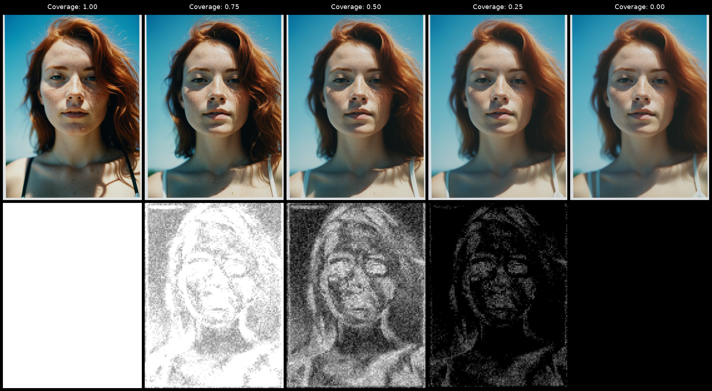
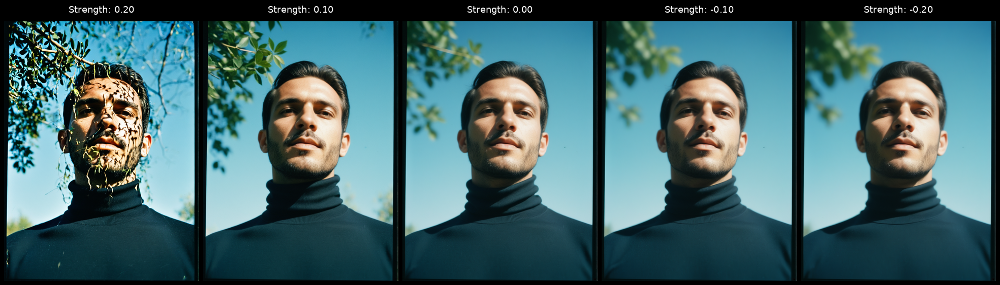
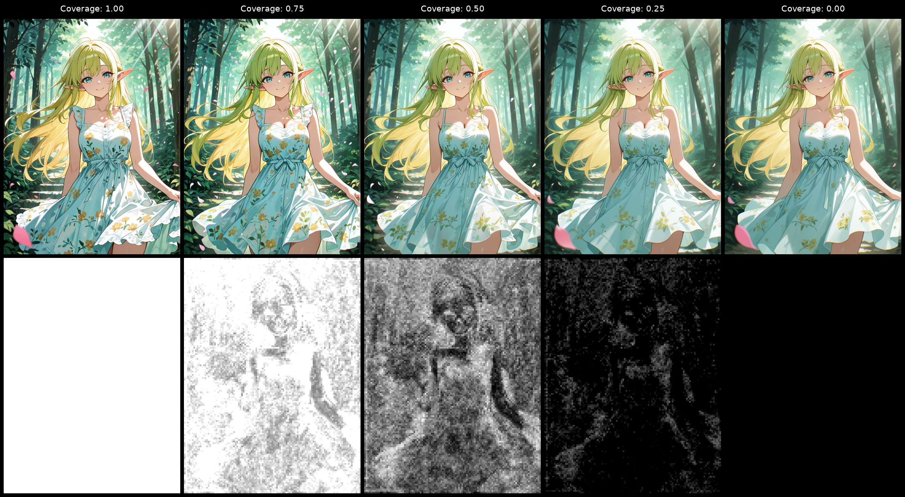
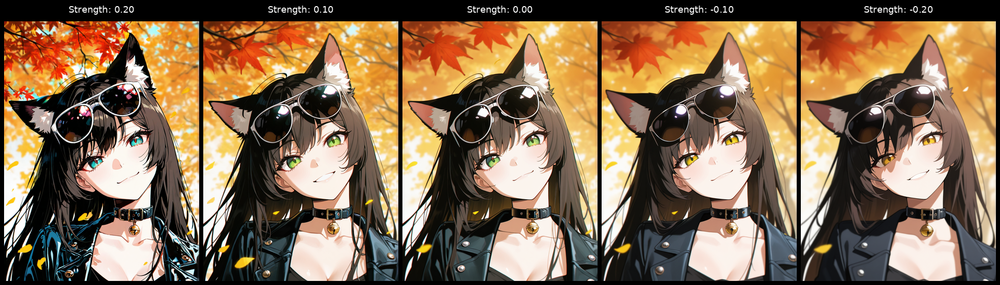

# ComfyUI-Selective-Sigma-Detailer

A ComfyUI custom sampler wrapper in the family of [Detail Daemon](https://github.com/Jonseed/ComfyUI-Detail-Daemon)
and its descendants. It sharpens an image mid-sampling by telling the
denoiser that the remaining noise is smaller than it actually is, which
nudges the model to commit to higher-frequency structure. The difference is
that this wrapper does it selectively: the strongest shift lands on regions
where structure is still forming, and smooth or settled regions receive a
substantially attenuated shift rather than the full effect. The mask is a
soft weighting, not a binary gate.

Selectivity exists because global sigma modulation has a failure mode. It
sharpens everything, including the regions that were supposed to stay
smooth. Clean skies develop grain, soft bokeh turns crunchy, solid-color
illustrations lose their flatness. Detail Daemon, MultiplySigmas, and
similar tricks all share this behavior. If a composition depends on a
genuinely clean background or a shallow depth of field, a global detailer
works against you. This node concentrates the shift on regions the model
is already drawing detail in, so smooth regions receive a much weaker dose
of the same effect rather than the full hit.

The mask is built by running the model once at the normal sigma and
comparing the result against the previous step's prediction. Regions where
the prediction is still changing step-to-step count as busy. A second pass
runs at a reduced sigma and gets blended with the first by the mask. This
means the wrapper costs roughly two model forwards per active step instead
of one, a meaningful overhead, made less painful by skipping the first 10%
of steps (composition phase) and tapering off so the last 10% is clean
(structure locked in, plus headroom for the sampler to clean residual
noise). A typical 16-step SDXL run ends up paying for about twelve detail
passes rather than sixteen. Still more expensive than a plain
sampler or Detail Daemon, worth it specifically when preserving smooth
regions matters to the composition.

The reason two forwards are required is that sigma is a scalar from the
denoiser's perspective. You cannot pass a spatial sigma map in a single
model call without retraining. Running twice and blending by the mask is
the only way to get region-selective behavior out of the existing model.

## Install

**Via ComfyUI Manager (recommended).** Open Manager, search for `Selective Sigma Detailer`, install, restart ComfyUI. The node is published on the [Comfy Registry](https://registry.comfy.org/publishers/capacap/nodes/comfyui-selective-sigma-detailer) and Manager pulls from there directly.

**Manual.** Clone into your `custom_nodes/` directory:

```
cd ComfyUI/custom_nodes
git clone https://github.com/Capacap/ComfyUI-Selective-Sigma-Detailer
```

Restart ComfyUI. There are no extra dependencies beyond what ComfyUI itself ships.

## Examples

Two checkpoint families are shown to demonstrate that the wrapper is architecture-level rather than tuned to a single style: Juggernaut XL for photographic realism and an Illustrious-family checkpoint for stylized anime. Within each sweep the seed is fixed; the seed differs between the coverage and strength sweeps to vary the composition.

### Realistic (Juggernaut XL)

**Coverage sweep at strength = +0.10.** The bottom row shows the mask captured during sampling. At `c=0.00` no detail pass runs; at `c=1.00` the mask saturates and the single-pass fast path applies. Intermediate cells show the mask concentrating on the face, freckles, and hair, with low-density regions like the sky receiving substantially attenuated treatment rather than full protection. The mask is a soft weighting, not a binary gate, so subtle changes outside the high-density area are expected.



**Strength sweep at coverage = 0.5.** Coverage is held mid-range so the mask is doing real selective work, not saturating. Skin micro-detail and fabric weave sharpen as strength rises while low-density regions stay close to the baseline. Negative strength softens toward a smoother, more painterly reading. The `s=+0.20` cell is a deliberate over-strength reference; `s=+0.10` is closer to a usable setting.



### Anime (Illustrious)

Same axes as above, included to show behaviour on lineart-heavy output where the detail boost reads as crisper outlines and denser hatching rather than skin or fabric texture.

**Coverage sweep at strength = +0.10.** The mask concentrates on the character's outlines, hair strands, and dress trim; the foliage backdrop and dappled light receive a much weaker shift but are not fully isolated from the detail pass.



**Strength sweep at coverage = 0.5.** Negative strength softens linework toward a painterly reading; positive strength tightens outlines and adds detail to hair, eyes, and the autumn foliage behind the character. The effect is particularly visible on the sunglasses, where the reflections sharpen and gain definition as strength rises.



## Example workflows

Drop any of these into ComfyUI to load a working graph. They use the
Illustrious-family `waiIllustriousSDXL` checkpoint; swap in your own SDXL
checkpoint if you don't have it.

- [`example_workflows/ssd_simple.json`](example_workflows/ssd_simple.json) — minimal txt2img with Selective Sigma Detailer as the sampler.
- [`example_workflows/ssd_hiresfix.json`](example_workflows/ssd_hiresfix.json) — base sample → latent upscale → Selective Sigma Detailer second pass, packaged as a subgraph.
- [`example_workflows/ssd_debug.json`](example_workflows/ssd_debug.json) — Debug sampler + Debug Preview wired to visualise the mask alongside a normal run.

## Nodes

All nodes live under `sampling/custom_sampling/samplers`.

**Selective Sigma Detailer.** The main node. Wraps a `SAMPLER` and returns a
new `SAMPLER` to drop between `KSamplerSelect` and `SamplerCustom`. Two
parameters: `strength` (default 0.1) is the peak per-step fraction of sigma
removed during the detail pass, so 0.1 means "shave 10% off sigma at peak";
negative values soften instead of sharpen. `coverage` (default 0.5) shifts
the mask threshold. At 0 it disables the detail pass entirely, at 0.5 it
uses the raw normalized mask, at 1.0 it saturates the mask and applies the
shift everywhere (and skips the normal pass, leaving one forward per active
step, equivalent to running Detail Daemon on the same schedule).

Fast paths: `strength = 0` or `coverage = 0` returns the input sampler
unmodified with no wrapping. `coverage = 1` skips the normal forward per
active step and runs only the detail pass.

**Selective Sigma Detailer (Debug).** Same sampler wrapper with the internal
constants (`start`, `end`, `ema`, `mask_clip_percentile`) exposed as inputs
and a `mask_ref` output. Use when diagnosing unexpected behavior or
experimenting with different constants. Defaults match the main node.

**Selective Sigma Detailer (Debug Preview).** Takes the `mask_ref` from the
Debug sampler and renders the last captured mask as a preview image.
Latent passthrough is required so ComfyUI runs it after sampling finishes.

Each run prints a stats line to the console showing how many steps paid
for the detail pass, the count of short-circuits by reason, and the total
forwards saved:

```
[SSD] calls=16 detail=9 full=0 skip: schedule=6 activity=0 first=1 range=0 (7 forwards saved)
```

`detail` is the two-forward path, `full` is the one-forward coverage=1
path, and `skip` breaks down no-op calls by cause: `schedule` (outside the
active window), `activity` (mask too sparse to matter), `first` (no prior
prediction to diff against yet), and `range` (sigma outside the schedule,
typically ancestral or solver-probe calls). A trailing `cfg++attenuated`
tag appears when the wrapped sampler is a CFG++ variant (see below).

## CFG++ samplers

CFG++ samplers (`_cfg_pp` variants) decompose each step into two signals
that must come from the same model call: the returned `denoised` (x0
target) and a separately captured `uncond_denoised` (noise direction). Our
two-forward blend mixes `denoised` across two sigmas while the uncond stays
tied to one, which introduces a cross-sigma term that amplifies effective
strength substantially at typical mid-mask coverage. The wrapper detects
CFG++ by inspecting the sampler's `post_cfg_function` hook chain and
attenuates `strength` by 0.15 to compensate. The calibration is accurate at
mid-mask and over-attenuates as the mask saturates toward 1; if you want
full-strength detail on a CFG++ sampler, prefer `coverage = 1` (single-pass
fast path, same behavior as plain Detail Daemon on CFG++). Selective
behavior between 0 and 1 on CFG++ is a best-effort approximation rather
than a mathematically clean blend.

## Credits

Schedule gating and the sigma-shift mechanic adapted from
[ComfyUI-Detail-Daemon](https://github.com/Jonseed/ComfyUI-Detail-Daemon)
by Jonseed.

## License

MIT.
